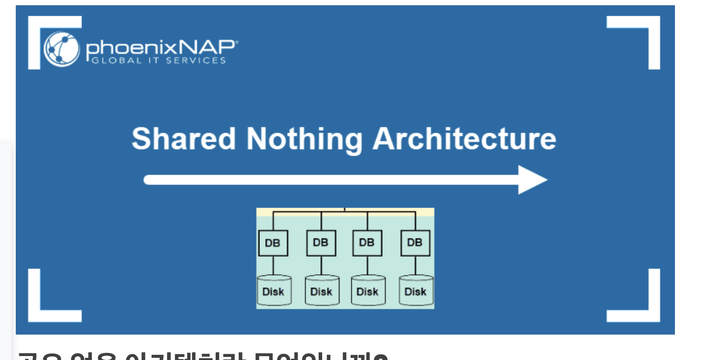
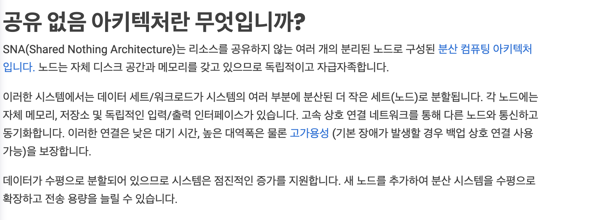
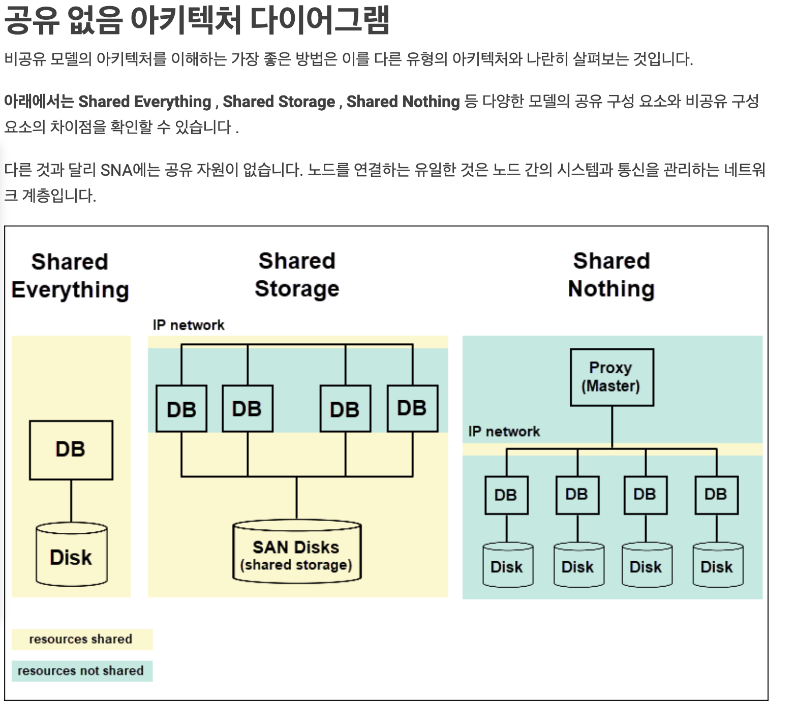

p. 119 배열 훑어보기

모던 자바스크립트 딥 다이브라는 책에서

- 자바스크립트에 배열이라는 타입은 존재하지 않는다.
- 배열은 객체지만 일반 객체와 구별되는 독특한 특징이 있다.
  - 값의 순서와 length 프로퍼티를 가진다. (어떻게 보면 문자열도 배열이다(유사배열 객체))
- 일반적으로 자료구조에서 말하는 배열은 동일한 크기의 메모리 공간이 빈틈없이 연속적으로 나열된 자료구조를 말하는데, 자바스크립트의 배열은 일반적인 의미의 배열과 다르다.
  - 각각의 메모리 공간은 동일한 크기를 갖지 않아도 되며, 연속적으로 이어져 있지 않을 수도 있다.(희소배열 )

-> 자바스크립트 배열은 일반적인 배열의 동작을 흉내 낸 특수한 객체이다.

### 희소 배열

```
const 희소배열 = [ ,2, , 4];
f
```

```
const a = "string";

console.log(a.length); // 6

console.log(a[1]); // t

```

### 공부하다 보니 머리가 뒤죽박죽이 된 거 같음

- 분명 저번시간에는 액션, 계산, 데이터로 구분해서 함수를 쪼갠다고 들었는데 이번 시간에는 카피온라이트에서 읽기와 쓰기로 구분하게 되면서 arraySet 함수를 만들때 계산이 일어나는 함수를 따로 뺄 수 있을거 같아서 이렇게 만들어봤는데 다른 분들의 생각은 어떠신지 궁금하다.

// 질문 쓰면서 나도 잘 정리가 안되는거 같음

// 이 코드는 함수형 코딩 취지에 맞는 함수일까여

````
const set = (array, idx, value) => {
  array[idx] = value;
};

const arraySet = (array, idx, value) => {
  const newArray = [...array];
  set(newArray, idx, value);
  return newArray;
};

function bookAnswer(array, idx, value) {
  var copy = array.slice();
  copy[idx] = value;
  return copy;
}
```
````

### 다른 분들의 object 메소드 사용 경험 궁금하다.

```
const objectDelete = (object, key) => {
  //  const newObject = delete { ...object }[key];
  // 이러면 안되는 이유가 있는데 delete는 속성을 성공적으로 제거하면 true를 반환한다. 그래서 newObject가 true값이 담긴다.
  //
  const newObject = { ...object };
  // 이 delete 부분을 계산으로 뺄수는 없나?
  //delete newObject[key];
  deleteFunc(newObject, key);
  return newObject;
};
const deleteFunc = (object, key) => {
  delete object[key];
};

console.log(objectDelete({ a: 5 }, "a"));

```

### p.144

- 책에서는 cart 배열을 복사하고 for 문을 돌면서 각각 요소를 다시 복사하면서 속성들을 업데이트 해준다.

```
const A_setQuantityByName = (cart, name, quantity) => {
  // const newCart = [...cart].map((item) => {
  //   if (item.name === name) item.quantity = quantity;
  //   return item;
  // });
  // return newCart;
  const newCart = [...cart].map((item) => {
    if (item.name === name) {
      return { ...item, quantity };
    }
    return { ...item };
  });
  console.log(newCart);
  return newCart;
};
console.log(testArr);
A_setQuantityByName(testArr, "hojoon", 50);
// console.log(A_setQuantityByName(testArr, "hojoon", 50));
```

예제 161쪽 5번 문제에 나온 비공유 아키텍처란



